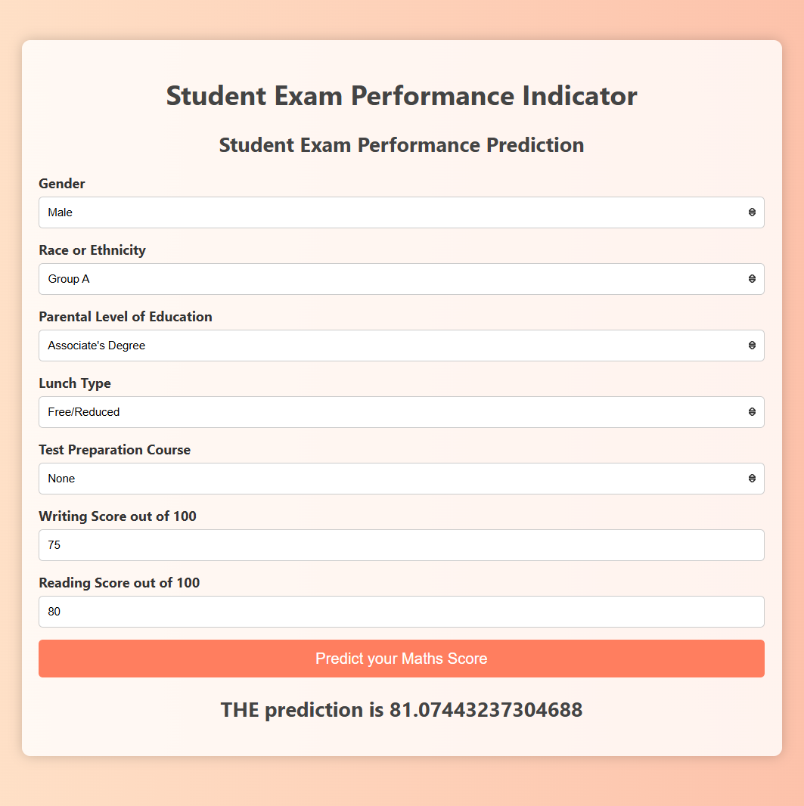

# Predicting Student Performance Using ML


## Introduction
This project utilizes machine learning techniques to predict student performance based on historical data. The goal is to provide insights that can help improve educational outcomes.

## Project Structure
```text
student-performance-predictor/
├── assets/
│ └── img.png
├── data/
│ └── data.csv
├── src/
│ ├── __init__.py
│ ├── logger.py
│ ├── exception.py
│ ├── utils.py
│ ├── components/
│ │ ├── __init__.py
│ │ ├── data_ingestion.py
│ │ ├── data_transformation.py
│ │ └── model_trainer.py
│ ├── pipeline/
│ │ ├── __init__.py
│ │ ├── train_pipeline.py
│ │ └── predict_pipeline.py
│ └── templates/
│   ├── home.html
│   └── index.html
├── app.py
├── requirements.txt
└── README.md
```

## Technologies Used
* **Python**: Version 3.9 for core programming.
* **Scikit-learn**: For building and training machine learning models.
* **Flask**: For creating a web application to serve predictions.

## Installation
To set up the project, follow these steps:

1. Create a new Conda environment:
   ```shell
   conda create --name myenv python==3.10
   ```
2. Activate the environment:
   ```shell
   conda activate myenv
   ```
3. Install the required dependencies:
   ```shell
   pip install -r requirements.txt
   ```

## Running the Project
To run the project, follow these steps:
1. Navigate to the `src/components` directory (To do model training and saving the model):
   ```shell
      python data_ingestion.py
      ```
2. Navigate to the project directory:
   ```shell
   cd project
   ```
3. Run the Flask server:
   ```shell
   python app.py
   ```

Once the server is running, you can access the application in your web browser at:\
http://127.0.0.1:5000
